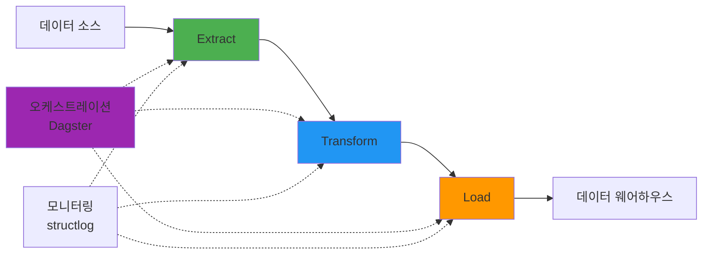
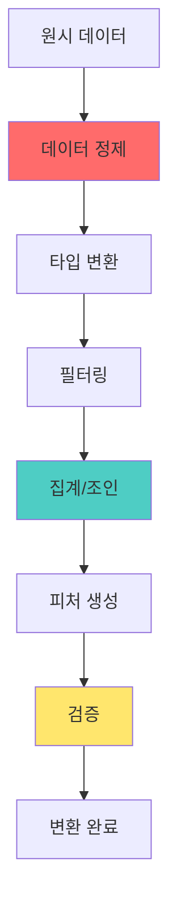
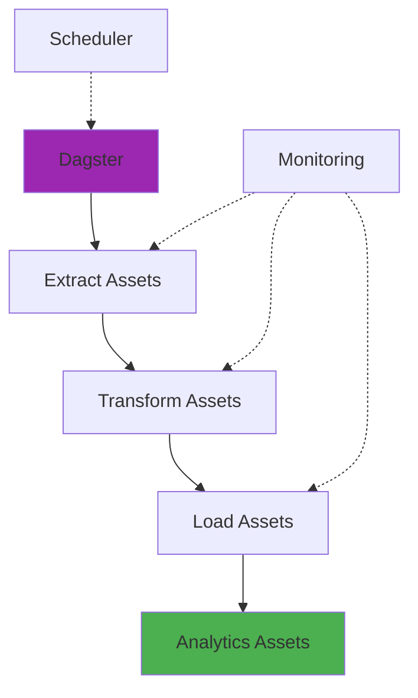

# 데이터 파이프라인 구축

## 목표

ETL (Extract, Transform, Load) 파이프라인을 구축하여 대용량 데이터를 효율적으로 처리하고, 안정적으로 운영하는 프로덕션급 데이터 처리 시스템 만들기

---

## 아키텍처 개요



---

## 기술 스택

| 분야 | 도구 | 이유 | 대안 |
|------|------|------|------|
| 데이터프레임 | **Polars** | pandas보다 10배 빠름, 메모리 효율 | pandas, Dask |
| SQL 분석 | **DuckDB** | 인메모리 OLAP, Parquet 최적화 | SQLite, PostgreSQL |
| 워크플로우 | **Dagster** | 현대적 오케스트레이션, 타입 체크 | Airflow, Prefect |
| 파일 포맷 | **Parquet** | 압축률 80%+, 컬럼형 읽기 | CSV, JSON |
| 로깅 | **structlog** | 구조화 로그, 검색 가능 | logging |
| 스케줄링 | **APScheduler** | Python 네이티브, 유연함 | cron, Celery |

---

## ETL 파이프라인 전체 구조

### 1. 프로젝트 구조

```
data-pipeline/
├── pyproject.toml
├── config/
│   ├── development.yaml
│   └── production.yaml
├── data/
│   ├── raw/           # 원시 데이터
│   ├── staging/       # 중간 데이터
│   └── processed/     # 최종 데이터
├── pipelines/
│   ├── __init__.py
│   ├── extract.py     # 데이터 추출
│   ├── transform.py   # 데이터 변환
│   ├── load.py        # 데이터 적재
│   └── orchestration.py  # Dagster 정의
├── utils/
│   ├── logger.py      # 로깅 설정
│   ├── db.py          # DB 연결
│   └── monitoring.py  # 모니터링
└── tests/
    └── test_pipeline.py
```

### 2. 의존성 설치

```bash
# 프로젝트 초기화
$ uv init data-pipeline
$ cd data-pipeline

# 핵심 라이브러리
$ uv add polars duckdb dagster dagster-webserver

# 데이터 소스 커넥터
$ uv add httpx sqlalchemy asyncpg

# 유틸리티
$ uv add structlog pyyaml python-dotenv

# 개발 도구
$ uv add --dev pytest pytest-asyncio
```

---

## Extract (데이터 추출)

### 패턴 1: CSV/Parquet 파일 읽기

```python
# pipelines/extract.py
import polars as pl
from pathlib import Path
import structlog

logger = structlog.get_logger()

class DataExtractor:
    def __init__(self, data_dir: Path):
        self.data_dir = data_dir

    def extract_csv(self, filename: str) -> pl.DataFrame:
        """CSV 파일에서 데이터 추출"""
        filepath = self.data_dir / filename
        logger.info("extracting_csv", filepath=str(filepath))

        try:
            # Polars는 자동으로 타입 추론
            df = pl.read_csv(filepath)
            logger.info("csv_extracted", rows=len(df), columns=len(df.columns))
            return df

        except Exception as e:
            logger.error("csv_extraction_failed", filepath=str(filepath), error=str(e))
            raise

    def extract_parquet(self, filename: str) -> pl.DataFrame:
        """Parquet 파일에서 데이터 추출 (더 빠름)"""
        filepath = self.data_dir / filename
        logger.info("extracting_parquet", filepath=str(filepath))

        df = pl.read_parquet(filepath)
        logger.info("parquet_extracted", rows=len(df), size_mb=filepath.stat().st_size / 1024 / 1024)
        return df

    def extract_csv_lazy(self, pattern: str) -> pl.LazyFrame:
        """여러 CSV 파일을 Lazy 모드로 추출 (메모리 절약)"""
        files = list(self.data_dir.glob(pattern))
        logger.info("extracting_csv_lazy", file_count=len(files))

        # Lazy evaluation - 실제 연산은 collect() 호출 시
        df = pl.scan_csv(files)
        return df
```

### 패턴 2: 데이터베이스에서 추출

```python
import duckdb
from sqlalchemy import create_engine
import polars as pl

class DatabaseExtractor:
    def __init__(self, connection_string: str):
        self.engine = create_engine(connection_string)

    def extract_from_postgres(self, query: str) -> pl.DataFrame:
        """PostgreSQL에서 데이터 추출"""
        logger.info("extracting_from_postgres", query=query[:100])

        # SQLAlchemy 엔진 사용
        df = pl.read_database(query, self.engine)

        logger.info("postgres_extracted", rows=len(df))
        return df

    def extract_incremental(self, table: str, timestamp_column: str, last_timestamp: str) -> pl.DataFrame:
        """증분 추출 (변경된 데이터만)"""
        query = f"""
            SELECT *
            FROM {table}
            WHERE {timestamp_column} > '{last_timestamp}'
            ORDER BY {timestamp_column}
        """

        logger.info("incremental_extraction", table=table, since=last_timestamp)
        return self.extract_from_postgres(query)
```

### 패턴 3: API에서 데이터 추출

```python
import httpx
import asyncio
from typing import List, Dict, Any

class APIExtractor:
    def __init__(self, base_url: str, api_key: str):
        self.client = httpx.AsyncClient(
            base_url=base_url,
            headers={'Authorization': f'Bearer {api_key}'},
            timeout=30.0
        )

    async def extract_paginated(self, endpoint: str, per_page: int = 100) -> pl.DataFrame:
        """페이지네이션된 API 데이터 추출"""
        all_data = []
        page = 1

        while True:
            logger.info("fetching_api_page", endpoint=endpoint, page=page)

            response = await self.client.get(
                endpoint,
                params={'page': page, 'per_page': per_page}
            )
            response.raise_for_status()

            data = response.json()
            if not data:
                break

            all_data.extend(data)
            page += 1

            # Rate limiting
            await asyncio.sleep(0.1)

        logger.info("api_extraction_complete", total_records=len(all_data))

        # JSON을 DataFrame으로 변환
        return pl.DataFrame(all_data)

    async def extract_parallel(self, endpoints: List[str]) -> Dict[str, pl.DataFrame]:
        """여러 API 엔드포인트를 병렬로 추출"""
        tasks = [self.extract_paginated(ep) for ep in endpoints]
        results = await asyncio.gather(*tasks)

        return {endpoint: df for endpoint, df in zip(endpoints, results)}

    async def close(self):
        await self.client.aclose()
```

### 패턴 4: 여러 소스 통합 추출

```python
from datetime import datetime
from typing import Optional

class UnifiedExtractor:
    """여러 데이터 소스를 통합 관리"""

    def __init__(self, config: dict):
        self.file_extractor = DataExtractor(Path(config['data_dir']))
        self.db_extractor = DatabaseExtractor(config['db_url'])
        self.api_extractor = APIExtractor(config['api_url'], config['api_key'])

    async def extract_all(self) -> Dict[str, pl.DataFrame]:
        """모든 소스에서 데이터 추출"""
        logger.info("starting_full_extraction")

        # 파일에서 추출 (동기)
        users_file = self.file_extractor.extract_parquet("users.parquet")
        products_file = self.file_extractor.extract_csv("products.csv")

        # 데이터베이스에서 증분 추출
        last_sync = self._get_last_sync_timestamp()
        orders_db = self.db_extractor.extract_incremental(
            "orders",
            "created_at",
            last_sync
        )

        # API에서 추출 (비동기)
        api_data = await self.api_extractor.extract_parallel([
            "/analytics/events",
            "/analytics/sessions"
        ])

        await self.api_extractor.close()

        return {
            'users': users_file,
            'products': products_file,
            'orders': orders_db,
            **api_data
        }

    def _get_last_sync_timestamp(self) -> str:
        """마지막 동기화 시간 조회"""
        # 실제로는 메타데이터 DB에서 조회
        return "2026-01-01 00:00:00"
```

---

## Transform (데이터 변환)



### 패턴 1: 기본 데이터 정제

```python
# pipelines/transform.py
import polars as pl
from typing import List

class DataTransformer:
    @staticmethod
    def clean_dataframe(df: pl.DataFrame) -> pl.DataFrame:
        """기본 데이터 정제"""
        logger.info("cleaning_dataframe", rows_before=len(df))

        df_clean = (
            df
            # 중복 제거
            .unique()
            # NULL 처리
            .drop_nulls(subset=['id'])  # 필수 컬럼만
            .with_columns([
                # 결측치 채우기
                pl.col("age").fill_null(0),
                pl.col("description").fill_null("N/A"),
            ])
            # 이상치 제거
            .filter(pl.col("age").is_between(0, 120))
        )

        logger.info("cleaning_complete",
                   rows_after=len(df_clean),
                   rows_removed=len(df) - len(df_clean))

        return df_clean

    @staticmethod
    def normalize_text_columns(df: pl.DataFrame, columns: List[str]) -> pl.DataFrame:
        """텍스트 정규화"""
        transformations = []

        for col in columns:
            transformations.append(
                pl.col(col)
                .str.to_lowercase()
                .str.strip_chars()
                .alias(f"{col}_normalized")
            )

        return df.with_columns(transformations)

    @staticmethod
    def convert_types(df: pl.DataFrame) -> pl.DataFrame:
        """타입 변환"""
        return df.with_columns([
            pl.col("created_at").str.strptime(pl.Datetime, "%Y-%m-%d %H:%M:%S"),
            pl.col("price").cast(pl.Float64),
            pl.col("user_id").cast(pl.Int64),
        ])
```

### 패턴 2: DuckDB를 사용한 복잡한 변환

```python
import duckdb

class DuckDBTransformer:
    def __init__(self):
        self.con = duckdb.connect()

    def transform_with_sql(
        self,
        users: pl.DataFrame,
        orders: pl.DataFrame,
        products: pl.DataFrame
    ) -> pl.DataFrame:
        """SQL을 사용한 복잡한 조인 및 집계"""

        # DuckDB는 Polars DataFrame을 직접 쿼리 가능!
        result = self.con.execute("""
            WITH order_details AS (
                SELECT
                    o.order_id,
                    o.user_id,
                    o.created_at,
                    p.product_name,
                    p.category,
                    o.quantity,
                    o.quantity * p.price AS total_amount
                FROM orders o
                JOIN products p ON o.product_id = p.product_id
            ),
            user_metrics AS (
                SELECT
                    u.user_id,
                    u.name,
                    u.email,
                    u.country,
                    COUNT(DISTINCT od.order_id) AS total_orders,
                    SUM(od.total_amount) AS lifetime_value,
                    AVG(od.total_amount) AS avg_order_value,
                    MAX(od.created_at) AS last_order_date,
                    COUNT(DISTINCT od.category) AS categories_purchased
                FROM users u
                LEFT JOIN order_details od ON u.user_id = od.user_id
                GROUP BY u.user_id, u.name, u.email, u.country
            )
            SELECT
                *,
                CASE
                    WHEN lifetime_value > 1000 THEN 'VIP'
                    WHEN lifetime_value > 500 THEN 'Premium'
                    WHEN lifetime_value > 100 THEN 'Regular'
                    ELSE 'New'
                END AS customer_segment,
                DATE_DIFF('day', last_order_date, CURRENT_DATE) AS days_since_last_order
            FROM user_metrics
            ORDER BY lifetime_value DESC
        """).pl()

        logger.info("sql_transformation_complete", result_rows=len(result))
        return result

    def create_rfm_segments(self, orders: pl.DataFrame) -> pl.DataFrame:
        """RFM (Recency, Frequency, Monetary) 분석"""
        query = """
            WITH rfm AS (
                SELECT
                    user_id,
                    DATE_DIFF('day', MAX(created_at), CURRENT_DATE) AS recency,
                    COUNT(DISTINCT order_id) AS frequency,
                    SUM(total_amount) AS monetary
                FROM orders
                GROUP BY user_id
            ),
            rfm_scores AS (
                SELECT
                    *,
                    NTILE(5) OVER (ORDER BY recency DESC) AS r_score,
                    NTILE(5) OVER (ORDER BY frequency) AS f_score,
                    NTILE(5) OVER (ORDER BY monetary) AS m_score
                FROM rfm
            )
            SELECT
                *,
                CONCAT(r_score, f_score, m_score) AS rfm_segment,
                (r_score + f_score + m_score) / 3.0 AS rfm_score
            FROM rfm_scores
            ORDER BY rfm_score DESC
        """

        return self.con.execute(query).pl()
```

### 패턴 3: 시계열 데이터 변환

```python
def transform_timeseries(df: pl.DataFrame) -> pl.DataFrame:
    """시계열 데이터 집계 및 피처 생성"""

    df_ts = (
        df
        .sort("timestamp")
        .with_columns([
            # 날짜 추출
            pl.col("timestamp").dt.date().alias("date"),
            pl.col("timestamp").dt.hour().alias("hour"),
            pl.col("timestamp").dt.day_name().alias("day_of_week"),

            # 이동 평균
            pl.col("sales").rolling_mean(window_size=7).alias("sales_7d_avg"),
            pl.col("sales").rolling_mean(window_size=30).alias("sales_30d_avg"),

            # 누적 합계
            pl.col("sales").cum_sum().alias("cumulative_sales"),
        ])
        .with_columns([
            # 전일 대비 증감
            (pl.col("sales") - pl.col("sales").shift(1)).alias("daily_change"),

            # 주말 여부
            pl.col("day_of_week").is_in(["Saturday", "Sunday"]).alias("is_weekend"),
        ])
    )

    return df_ts
```

### 패턴 4: 데이터 품질 검증

```python
from typing import Dict, Any
from dataclasses import dataclass

@dataclass
class DataQualityCheck:
    check_name: str
    passed: bool
    details: Dict[str, Any]

class DataQualityValidator:
    @staticmethod
    def validate(df: pl.DataFrame, rules: Dict[str, Any]) -> List[DataQualityCheck]:
        """데이터 품질 검증"""
        checks = []

        # 1. 행 개수 검증
        if 'min_rows' in rules:
            passed = len(df) >= rules['min_rows']
            checks.append(DataQualityCheck(
                check_name="row_count",
                passed=passed,
                details={'actual': len(df), 'expected': rules['min_rows']}
            ))

        # 2. NULL 비율 검증
        if 'max_null_ratio' in rules:
            for col in df.columns:
                null_ratio = df[col].null_count() / len(df)
                passed = null_ratio <= rules['max_null_ratio']

                checks.append(DataQualityCheck(
                    check_name=f"null_ratio_{col}",
                    passed=passed,
                    details={'column': col, 'null_ratio': null_ratio}
                ))

        # 3. 유니크 값 검증
        if 'unique_columns' in rules:
            for col in rules['unique_columns']:
                unique_count = df[col].n_unique()
                passed = unique_count == len(df)

                checks.append(DataQualityCheck(
                    check_name=f"uniqueness_{col}",
                    passed=passed,
                    details={'column': col, 'unique_count': unique_count, 'total': len(df)}
                ))

        # 4. 값 범위 검증
        if 'value_ranges' in rules:
            for col, (min_val, max_val) in rules['value_ranges'].items():
                out_of_range = df.filter(
                    ~pl.col(col).is_between(min_val, max_val)
                ).height

                passed = out_of_range == 0

                checks.append(DataQualityCheck(
                    check_name=f"range_{col}",
                    passed=passed,
                    details={'column': col, 'out_of_range_count': out_of_range}
                ))

        # 로깅
        failed_checks = [c for c in checks if not c.passed]
        if failed_checks:
            logger.warning("data_quality_issues", failed_count=len(failed_checks))
            for check in failed_checks:
                logger.warning("failed_check", **check.__dict__)
        else:
            logger.info("data_quality_passed", total_checks=len(checks))

        return checks
```

---

## Load (데이터 적재)

### 패턴 1: Parquet 파일로 저장

```python
# pipelines/load.py
from pathlib import Path
import polars as pl

class DataLoader:
    def __init__(self, output_dir: Path):
        self.output_dir = output_dir
        self.output_dir.mkdir(parents=True, exist_ok=True)

    def load_to_parquet(self, df: pl.DataFrame, filename: str, partition_by: str = None):
        """Parquet 파일로 저장"""
        filepath = self.output_dir / filename

        logger.info("loading_to_parquet",
                   filepath=str(filepath),
                   rows=len(df),
                   partition_by=partition_by)

        if partition_by:
            # 파티션별로 저장 (대용량 데이터 최적화)
            df.write_parquet(
                filepath,
                compression='snappy',
                partition_by=partition_by
            )
        else:
            df.write_parquet(filepath, compression='snappy')

        # 파일 크기 로깅
        size_mb = filepath.stat().st_size / 1024 / 1024
        logger.info("parquet_saved", size_mb=round(size_mb, 2))

    def load_to_csv(self, df: pl.DataFrame, filename: str):
        """CSV 파일로 저장 (호환성)"""
        filepath = self.output_dir / filename
        df.write_csv(filepath)
        logger.info("csv_saved", filepath=str(filepath))
```

### 패턴 2: 데이터베이스에 적재

```python
from sqlalchemy import create_engine
import polars as pl

class DatabaseLoader:
    def __init__(self, connection_string: str):
        self.engine = create_engine(connection_string)

    def load_to_postgres(self, df: pl.DataFrame, table_name: str, if_exists: str = 'replace'):
        """PostgreSQL에 적재"""
        logger.info("loading_to_postgres",
                   table=table_name,
                   rows=len(df),
                   mode=if_exists)

        # Polars → pandas → SQLAlchemy
        df.to_pandas().to_sql(
            table_name,
            self.engine,
            if_exists=if_exists,
            index=False,
            method='multi',  # 배치 insert
            chunksize=10000  # 10k 행씩
        )

        logger.info("postgres_load_complete", table=table_name)

    def load_incremental(self, df: pl.DataFrame, table_name: str, merge_key: str):
        """증분 적재 (UPSERT)"""
        logger.info("incremental_load", table=table_name, merge_key=merge_key)

        # 임시 테이블 생성
        temp_table = f"{table_name}_temp"
        df.to_pandas().to_sql(temp_table, self.engine, if_exists='replace', index=False)

        # UPSERT 쿼리
        with self.engine.begin() as conn:
            conn.execute(f"""
                INSERT INTO {table_name}
                SELECT * FROM {temp_table}
                ON CONFLICT ({merge_key})
                DO UPDATE SET
                    {', '.join([f"{col} = EXCLUDED.{col}" for col in df.columns if col != merge_key])}
            """)

            conn.execute(f"DROP TABLE {temp_table}")

        logger.info("incremental_load_complete")
```

### 패턴 3: DuckDB로 데이터 웨어하우스 구축

```python
import duckdb

class DuckDBWarehouse:
    def __init__(self, db_path: str):
        self.con = duckdb.connect(db_path)
        logger.info("duckdb_warehouse_initialized", path=db_path)

    def create_table_from_dataframe(self, df: pl.DataFrame, table_name: str):
        """DataFrame에서 테이블 생성"""
        self.con.execute(f"CREATE OR REPLACE TABLE {table_name} AS SELECT * FROM df")
        logger.info("table_created", table=table_name, rows=len(df))

    def create_analytics_views(self):
        """분석용 뷰 생성"""

        # 일별 매출 뷰
        self.con.execute("""
            CREATE OR REPLACE VIEW daily_sales AS
            SELECT
                DATE(created_at) AS date,
                COUNT(DISTINCT order_id) AS order_count,
                SUM(total_amount) AS revenue,
                AVG(total_amount) AS avg_order_value
            FROM orders
            GROUP BY DATE(created_at)
        """)

        # 사용자 세그먼트 뷰
        self.con.execute("""
            CREATE OR REPLACE VIEW user_segments AS
            SELECT
                u.user_id,
                u.name,
                u.country,
                us.customer_segment,
                us.lifetime_value,
                us.days_since_last_order
            FROM users u
            JOIN user_stats us ON u.user_id = us.user_id
        """)

        logger.info("analytics_views_created")

    def export_to_parquet(self, table_name: str, output_path: str):
        """테이블을 Parquet로 내보내기"""
        self.con.execute(f"""
            COPY (SELECT * FROM {table_name})
            TO '{output_path}' (FORMAT PARQUET, COMPRESSION SNAPPY)
        """)
        logger.info("table_exported", table=table_name, path=output_path)
```

---

## Orchestration (오케스트레이션)



### Dagster로 파이프라인 구성

```python
# pipelines/orchestration.py
from dagster import (
    asset,
    AssetExecutionContext,
    Definitions,
    ScheduleDefinition,
    sensor,
    RunRequest,
    AssetSelection,
)
import polars as pl
from pathlib import Path

# ===== Extract Assets =====

@asset(group_name="extract")
def raw_users(context: AssetExecutionContext) -> pl.DataFrame:
    """원시 사용자 데이터 추출"""
    context.log.info("Extracting users from CSV")

    extractor = DataExtractor(Path("data/raw"))
    df = extractor.extract_csv("users.csv")

    context.log.info(f"Extracted {len(df)} users")
    return df

@asset(group_name="extract")
def raw_orders(context: AssetExecutionContext) -> pl.DataFrame:
    """원시 주문 데이터 추출"""
    context.log.info("Extracting orders from Parquet")

    extractor = DataExtractor(Path("data/raw"))
    df = extractor.extract_parquet("orders.parquet")

    context.log.info(f"Extracted {len(df)} orders")
    return df

@asset(group_name="extract")
def raw_products(context: AssetExecutionContext) -> pl.DataFrame:
    """원시 상품 데이터 추출"""
    context.log.info("Extracting products")

    extractor = DataExtractor(Path("data/raw"))
    df = extractor.extract_csv("products.csv")

    return df

# ===== Transform Assets =====

@asset(group_name="transform")
def clean_users(raw_users: pl.DataFrame) -> pl.DataFrame:
    """사용자 데이터 정제"""
    transformer = DataTransformer()

    df = (
        transformer.clean_dataframe(raw_users)
        .pipe(transformer.normalize_text_columns, columns=['email', 'name'])
        .pipe(transformer.convert_types)
    )

    # 데이터 품질 검증
    validator = DataQualityValidator()
    checks = validator.validate(df, {
        'min_rows': 100,
        'max_null_ratio': 0.05,
        'unique_columns': ['user_id', 'email'],
        'value_ranges': {'age': (0, 120)}
    })

    # 검증 실패 시 예외 발생
    if not all(c.passed for c in checks):
        raise ValueError("Data quality validation failed")

    return df

@asset(group_name="transform")
def clean_orders(raw_orders: pl.DataFrame) -> pl.DataFrame:
    """주문 데이터 정제"""
    transformer = DataTransformer()
    return transformer.clean_dataframe(raw_orders)

@asset(group_name="transform")
def clean_products(raw_products: pl.DataFrame) -> pl.DataFrame:
    """상품 데이터 정제"""
    transformer = DataTransformer()
    return transformer.clean_dataframe(raw_products)

@asset(group_name="transform")
def user_stats(
    clean_users: pl.DataFrame,
    clean_orders: pl.DataFrame,
    clean_products: pl.DataFrame
) -> pl.DataFrame:
    """사용자 통계 생성"""
    transformer = DuckDBTransformer()

    return transformer.transform_with_sql(
        users=clean_users,
        orders=clean_orders,
        products=clean_products
    )

@asset(group_name="transform")
def rfm_segments(clean_orders: pl.DataFrame) -> pl.DataFrame:
    """RFM 세그먼트 생성"""
    transformer = DuckDBTransformer()
    return transformer.create_rfm_segments(clean_orders)

# ===== Load Assets =====

@asset(group_name="load")
def warehouse_users(clean_users: pl.DataFrame, context: AssetExecutionContext):
    """사용자 데이터를 웨어하우스에 적재"""
    warehouse = DuckDBWarehouse("data/warehouse.db")
    warehouse.create_table_from_dataframe(clean_users, "users")

    context.log.info(f"Loaded {len(clean_users)} users to warehouse")

@asset(group_name="load")
def warehouse_user_stats(user_stats: pl.DataFrame, context: AssetExecutionContext):
    """사용자 통계를 웨어하우스에 적재"""
    warehouse = DuckDBWarehouse("data/warehouse.db")
    warehouse.create_table_from_dataframe(user_stats, "user_stats")

    # Parquet로도 내보내기
    loader = DataLoader(Path("data/processed"))
    loader.load_to_parquet(user_stats, "user_stats.parquet", partition_by="country")

    context.log.info("User stats loaded")

# ===== Analytics Assets =====

@asset(group_name="analytics")
def daily_revenue_report(clean_orders: pl.DataFrame) -> pl.DataFrame:
    """일별 매출 리포트"""
    return (
        clean_orders
        .group_by(pl.col("created_at").dt.date().alias("date"))
        .agg([
            pl.count().alias("order_count"),
            pl.sum("total_amount").alias("revenue"),
            pl.mean("total_amount").alias("avg_order_value"),
        ])
        .sort("date")
    )

# ===== Schedules =====

daily_pipeline = ScheduleDefinition(
    name="daily_pipeline",
    target=AssetSelection.all(),
    cron_schedule="0 2 * * *",  # 매일 오전 2시
)

# ===== Sensors =====

@sensor(target=AssetSelection.all())
def new_data_sensor(context):
    """새 데이터 파일 감지 시 파이프라인 실행"""
    data_dir = Path("data/raw")
    new_files = list(data_dir.glob("*.csv.new"))

    if new_files:
        context.log.info(f"Found {len(new_files)} new files")

        # 파일 이름 변경
        for file in new_files:
            file.rename(file.with_suffix(''))

        return RunRequest()

# ===== Definitions =====

defs = Definitions(
    assets=[
        # Extract
        raw_users,
        raw_orders,
        raw_products,
        # Transform
        clean_users,
        clean_orders,
        clean_products,
        user_stats,
        rfm_segments,
        # Load
        warehouse_users,
        warehouse_user_stats,
        # Analytics
        daily_revenue_report,
    ],
    schedules=[daily_pipeline],
    sensors=[new_data_sensor],
)
```

---

## 모니터링 및 로깅

### structlog 설정

```python
# utils/logger.py
import structlog
import logging
from pathlib import Path

def setup_logging(log_dir: Path, level: str = "INFO"):
    """구조화 로깅 설정"""

    log_dir.mkdir(parents=True, exist_ok=True)

    # 파일 핸들러
    file_handler = logging.FileHandler(log_dir / "pipeline.log")

    # structlog 설정
    structlog.configure(
        processors=[
            structlog.stdlib.filter_by_level,
            structlog.stdlib.add_logger_name,
            structlog.stdlib.add_log_level,
            structlog.processors.TimeStamper(fmt="iso"),
            structlog.processors.StackInfoRenderer(),
            structlog.processors.format_exc_info,
            structlog.processors.JSONRenderer()
        ],
        context_class=dict,
        logger_factory=structlog.stdlib.LoggerFactory(),
        cache_logger_on_first_use=True,
    )

    # 표준 로깅 설정
    logging.basicConfig(
        format="%(message)s",
        level=getattr(logging, level),
        handlers=[file_handler, logging.StreamHandler()]
    )
```

### 성능 모니터링

```python
# utils/monitoring.py
import time
from functools import wraps
from typing import Callable
import structlog

logger = structlog.get_logger()

def monitor_performance(func: Callable):
    """함수 실행 시간 모니터링"""

    @wraps(func)
    def wrapper(*args, **kwargs):
        start_time = time.time()

        logger.info("function_started", function=func.__name__)

        try:
            result = func(*args, **kwargs)
            elapsed = time.time() - start_time

            logger.info("function_completed",
                       function=func.__name__,
                       elapsed_seconds=round(elapsed, 2))

            return result

        except Exception as e:
            elapsed = time.time() - start_time

            logger.error("function_failed",
                        function=func.__name__,
                        elapsed_seconds=round(elapsed, 2),
                        error=str(e))
            raise

    return wrapper

# 사용
@monitor_performance
def expensive_transformation(df: pl.DataFrame) -> pl.DataFrame:
    # 복잡한 변환 로직
    return df
```

---

## 프로덕션 배포

### 1. Docker 컨테이너화

```dockerfile
# Dockerfile
FROM python:3.12-slim

WORKDIR /app

# uv 설치
COPY --from=ghcr.io/astral-sh/uv:latest /uv /usr/local/bin/uv

# 의존성 설치
COPY pyproject.toml .
RUN uv sync --frozen

# 코드 복사
COPY . .

# Dagster 웹서버 실행
CMD ["uv", "run", "dagster", "dev", "-h", "0.0.0.0", "-p", "3000"]
```

### 2. 환경 변수 관리

```python
# config.py
from pydantic_settings import BaseSettings

class Settings(BaseSettings):
    # 데이터베이스
    postgres_url: str
    duckdb_path: str = "data/warehouse.db"

    # API
    api_url: str
    api_key: str

    # 경로
    raw_data_dir: str = "data/raw"
    processed_data_dir: str = "data/processed"

    # 로깅
    log_level: str = "INFO"
    log_dir: str = "logs"

    class Config:
        env_file = ".env"

settings = Settings()
```

### 3. 에러 처리 및 재시도

```python
from tenacity import retry, stop_after_attempt, wait_exponential
import structlog

logger = structlog.get_logger()

@retry(
    stop=stop_after_attempt(3),
    wait=wait_exponential(multiplier=1, min=2, max=10),
    reraise=True
)
def extract_with_retry(extractor: APIExtractor, endpoint: str):
    """재시도 로직이 있는 추출"""
    try:
        return asyncio.run(extractor.extract_paginated(endpoint))
    except Exception as e:
        logger.warning("extraction_retry", endpoint=endpoint, error=str(e))
        raise
```

---

## 최적화 팁

### 1. Polars Lazy Evaluation 활용

```python
# Lazy 모드 - 메모리 효율적
df = (
    pl.scan_csv("large_file.csv")
    .filter(pl.col("age") > 18)
    .group_by("country")
    .agg(pl.count())
    .collect()  # 여기서 실제 실행
)
```

### 2. Parquet 파티셔닝

```python
# 날짜별 파티션 - 쿼리 성능 향상
df.write_parquet(
    "output/orders.parquet",
    partition_by=["year", "month"],
    compression="snappy"
)
```

### 3. DuckDB 병렬 처리

```python
con = duckdb.connect()
con.execute("SET threads TO 8")  # 8 스레드 사용
```

---

## 트러블슈팅

### 메모리 부족

```python
# 청크 단위 처리
chunk_size = 100000

for chunk in pl.read_csv_batched("huge_file.csv", batch_size=chunk_size):
    process_chunk(chunk)
```

### 타임아웃 에러

```python
# 타임아웃 증가
client = httpx.AsyncClient(timeout=60.0)
```

### 데이터 불일치

```python
# 트랜잭션 사용
with engine.begin() as conn:
    conn.execute("DELETE FROM staging_table")
    conn.execute("INSERT INTO staging_table SELECT * FROM temp")
```

---

## 마무리

여기까지 하면 기본적인 ETL 파이프라인은 완성입니다. Polars와 DuckDB를 쓰면 pandas보다 확실히 빠르고, Dagster로 워크플로우를 관리하면 나중에 복잡해져도 유지보수가 쉽습니다.

실전에서 자주 겪는 문제들:
- 메모리 부족: Lazy evaluation이나 청크 처리로 해결
- 데이터 품질: 검증 로직을 미리 넣어두면 나중에 디버깅이 훨씬 쉬움
- 실패한 작업 재처리: Dagster가 기본적으로 지원하긴 하지만, 멱등성을 고려해서 파이프라인을 짜야 함

Airflow랑 비교하면 Dagster가 훨씬 현대적이고 타입 체크도 되는데, 이미 Airflow 쓰고 있다면 굳이 바꿀 필요는 없습니다.

---

**[← LLM 서비스](llm-service.md)** | **[자동화 →](automation.md)**
