# LangChain 완벽 가이드

> **LLM 애플리케이션 개발 프레임워크**

⭐ **2026 추천** | 🤖 LLM | 🔗 체인 | 🧠 RAG

---

## 목차

- [개요](#개요)
- [왜 LangChain인가](#왜-langchain인가)
- [핵심 개념](#핵심-개념)
- [설치 및 기본 사용](#설치-및-기본-사용)
- [실전 패턴 10가지](#실전-패턴-10가지)
- [RAG 구현](#rag-구현)
- [프로덕션 고려사항](#프로덕션-고려사항)

---

## 개요

### 기본 정보

| 항목 | 내용 |
|------|------|
| **공식 사이트** | https://python.langchain.com |
| **GitHub** | https://github.com/langchain-ai/langchain |
| **PyPI** | https://pypi.org/project/langchain/ |
| **첫 릴리즈** | 2022년 10월 |
| **라이선스** | MIT |

### 한 줄 요약

**LLM을 활용한 애플리케이션 개발을 위한 통합 프레임워크**

---

## 왜 LangChain인가

### LLM 직접 호출의 문제

```python
# OpenAI 직접 호출 (번거로움)
import openai

response = openai.ChatCompletion.create(
    model="gpt-4",
    messages=[{"role": "user", "content": "Hello"}],
    temperature=0.7,
)
result = response.choices[0].message.content

# 문제:
# - 프롬프트 관리 어려움
# - 문서 검색 통합 복잡
# - 메모리/히스토리 관리 수동
# - 에러 처리 반복
```

### LangChain 방식

```python
from langchain.chat_models import ChatOpenAI
from langchain.prompts import ChatPromptTemplate
from langchain.schema.output_parser import StrOutputParser

# 체인 구성
llm = ChatOpenAI(model="gpt-4")
prompt = ChatPromptTemplate.from_template("Tell me about {topic}")
chain = prompt | llm | StrOutputParser()

# 간단한 실행
result = chain.invoke({"topic": "Python"})
```

---

## 핵심 개념

### 1. 체인 (Chains)

```mermaid
graph LR
    A[입력] --> B[프롬프트]
    B --> C[LLM]
    C --> D[출력 파서]
    D --> E[결과]

    style A fill:#4CAF50
    style E fill:#4CAF50
```



### 2. LCEL (LangChain Expression Language)

```python
# 파이프 연산자로 체인 구성
chain = prompt | llm | parser

# 동일한 의미
chain = prompt.chain(llm).chain(parser)
```

### 3. RAG 아키텍처

```mermaid
graph TB
    A[사용자 질문] --> B[임베딩 생성]
    B --> C[벡터 DB 검색]
    C --> D[관련 문서 검색]

    D --> E[컨텍스트 구성]
    A --> E
    E --> F[프롬프트 생성]

    F --> G[LLM 호출]
    G --> H[답변 생성]

    I[문서 데이터베이스] -.-> C

    style A fill:#4CAF50
    style H fill:#4CAF50
    style I fill:#2196F3
```



---

## 설치 및 기본 사용

### 설치

```bash
# 기본
$ uv add langchain langchain-openai

# RAG 관련
$ uv add langchain-community chromadb

# 문서 로더
$ uv add pypdf python-docx beautifulsoup4
```

### 기본 체인

```python
from langchain_openai import ChatOpenAI
from langchain.prompts import ChatPromptTemplate
from langchain.schema.output_parser import StrOutputParser

# LLM 초기화
llm = ChatOpenAI(
    model="gpt-4-turbo-preview",
    temperature=0,
    api_key="your-api-key"
)

# 프롬프트
prompt = ChatPromptTemplate.from_messages([
    ("system", "You are a helpful assistant."),
    ("user", "{input}")
])

# 체인 구성
chain = prompt | llm | StrOutputParser()

# 실행
result = chain.invoke({"input": "What is Python?"})
print(result)
```

---

## 실전 패턴 10가지

### 패턴 1: 프롬프트 템플릿

```python
from langchain.prompts import PromptTemplate

# 단순 템플릿
template = """
Translate the following text to {language}:

Text: {text}

Translation:
"""

prompt = PromptTemplate(
    template=template,
    input_variables=["language", "text"]
)

# 사용
formatted = prompt.format(language="Korean", text="Hello")
```

### 패턴 2: Few-Shot 프롬프트

```python
from langchain.prompts import FewShotPromptTemplate

examples = [
    {"input": "happy", "output": "sad"},
    {"input": "tall", "output": "short"},
]

example_prompt = PromptTemplate(
    input_variables=["input", "output"],
    template="Input: {input}\nOutput: {output}"
)

few_shot_prompt = FewShotPromptTemplate(
    examples=examples,
    example_prompt=example_prompt,
    prefix="Give the antonym of the word",
    suffix="Input: {input}\nOutput:",
    input_variables=["input"]
)
```

### 패턴 3: 문서 로더

```python
from langchain.document_loaders import (
    TextLoader,
    PyPDFLoader,
    DirectoryLoader
)

# 단일 파일
loader = TextLoader("document.txt")
documents = loader.load()

# PDF
pdf_loader = PyPDFLoader("document.pdf")
pages = pdf_loader.load()

# 디렉토리 전체
dir_loader = DirectoryLoader(
    "docs/",
    glob="**/*.txt",
    loader_cls=TextLoader
)
docs = dir_loader.load()
```

### 패턴 4: 텍스트 분할

```python
from langchain.text_splitter import RecursiveCharacterTextSplitter

splitter = RecursiveCharacterTextSplitter(
    chunk_size=1000,        # 청크 크기
    chunk_overlap=200,      # 중복 크기
    length_function=len,
)

splits = splitter.split_documents(documents)
print(f"Split into {len(splits)} chunks")
```

### 패턴 5: 벡터 스토어

```python
from langchain_openai import OpenAIEmbeddings
from langchain.vectorstores import Chroma

# 임베딩 모델
embeddings = OpenAIEmbeddings()

# 벡터 스토어 생성
vectorstore = Chroma.from_documents(
    documents=splits,
    embedding=embeddings,
    persist_directory="./chroma_db"
)

# 검색
results = vectorstore.similarity_search("query", k=3)
```

### 패턴 6: RAG 체인

```python
from langchain.chains import RetrievalQA

# Retriever 생성
retriever = vectorstore.as_retriever(
    search_kwargs={"k": 3}
)

# RAG 체인
qa_chain = RetrievalQA.from_chain_type(
    llm=llm,
    chain_type="stuff",  # map_reduce, refine, map_rerank
    retriever=retriever,
    return_source_documents=True
)

# 질문
result = qa_chain.invoke({"query": "What is the main topic?"})
print(result["result"])
print(result["source_documents"])
```

### 패턴 7: 대화 메모리

```python
from langchain.memory import ConversationBufferMemory
from langchain.chains import ConversationChain

# 메모리 초기화
memory = ConversationBufferMemory()

# 대화 체인
conversation = ConversationChain(
    llm=llm,
    memory=memory,
    verbose=True
)

# 대화
response1 = conversation.predict(input="Hi, I'm Alice")
# "Hello Alice! How can I help you?"

response2 = conversation.predict(input="What's my name?")
# "Your name is Alice"
```

### 패턴 8: 에이전트

```python
from langchain.agents import initialize_agent, Tool
from langchain.agents import AgentType

# 도구 정의
def calculator(query):
    return eval(query)

tools = [
    Tool(
        name="Calculator",
        func=calculator,
        description="Useful for math calculations"
    )
]

# 에이전트 초기화
agent = initialize_agent(
    tools=tools,
    llm=llm,
    agent=AgentType.ZERO_SHOT_REACT_DESCRIPTION,
    verbose=True
)

# 실행
agent.run("What is 25 * 4 + 10?")
```

### 패턴 9: 스트리밍 응답

```python
from langchain.callbacks.streaming_stdout import StreamingStdOutCallbackHandler

llm = ChatOpenAI(
    streaming=True,
    callbacks=[StreamingStdOutCallbackHandler()],
    temperature=0
)

# 실시간 출력
for chunk in llm.stream("Tell me a story"):
    print(chunk.content, end="", flush=True)
```

### 패턴 10: 구조화된 출력

```python
from langchain.output_parsers import PydanticOutputParser
from pydantic import BaseModel, Field

class Person(BaseModel):
    name: str = Field(description="person's name")
    age: int = Field(description="person's age")
    city: str = Field(description="city where person lives")

parser = PydanticOutputParser(pydantic_object=Person)

prompt = PromptTemplate(
    template="Extract person info from: {text}\n{format_instructions}",
    input_variables=["text"],
    partial_variables={"format_instructions": parser.get_format_instructions()}
)

chain = prompt | llm | parser

result = chain.invoke({"text": "Alice is 30 years old and lives in NYC"})
# Person(name='Alice', age=30, city='NYC')
```

---

## RAG 구현 (완전한 예제)

```python
from langchain_openai import ChatOpenAI, OpenAIEmbeddings
from langchain.document_loaders import DirectoryLoader, TextLoader
from langchain.text_splitter import RecursiveCharacterTextSplitter
from langchain.vectorstores import Chroma
from langchain.chains import RetrievalQA
from langchain.prompts import PromptTemplate

# 1. 문서 로드
loader = DirectoryLoader(
    "docs/",
    glob="**/*.txt",
    loader_cls=TextLoader
)
documents = loader.load()

# 2. 텍스트 분할
splitter = RecursiveCharacterTextSplitter(
    chunk_size=1000,
    chunk_overlap=200
)
splits = splitter.split_documents(documents)

# 3. 벡터 스토어 생성
embeddings = OpenAIEmbeddings()
vectorstore = Chroma.from_documents(
    documents=splits,
    embedding=embeddings,
    persist_directory="./db"
)

# 4. 프롬프트 커스터마이징
template = """
Use the following context to answer the question.
If you don't know, say "I don't know".

Context:
{context}

Question: {question}

Answer:
"""

prompt = PromptTemplate(
    template=template,
    input_variables=["context", "question"]
)

# 5. RAG 체인 생성
llm = ChatOpenAI(model="gpt-4", temperature=0)

qa_chain = RetrievalQA.from_chain_type(
    llm=llm,
    retriever=vectorstore.as_retriever(search_kwargs={"k": 3}),
    chain_type_kwargs={"prompt": prompt},
    return_source_documents=True
)

# 6. 질문
result = qa_chain.invoke({"query": "What is the main topic?"})

print("Answer:", result["result"])
print("\nSources:")
for doc in result["source_documents"]:
    print(f"- {doc.metadata.get('source', 'Unknown')}")
```

---

## 프로덕션 고려사항

### 1. 비용 추적

```python
from langchain.callbacks import get_openai_callback

with get_openai_callback() as cb:
    result = chain.invoke({"input": "question"})
    print(f"Total Tokens: {cb.total_tokens}")
    print(f"Total Cost: ${cb.total_cost:.4f}")
```

### 2. 캐싱

```python
from langchain.cache import InMemoryCache
from langchain.globals import set_llm_cache

set_llm_cache(InMemoryCache())

# 동일한 쿼리는 캐시에서 가져옴
```

### 3. 에러 처리

```python
from tenacity import retry, stop_after_attempt, wait_exponential

@retry(
    stop=stop_after_attempt(3),
    wait=wait_exponential(multiplier=1, min=2, max=10)
)
def call_llm_with_retry(chain, input):
    return chain.invoke(input)
```

### 4. 토큰 제한

```python
import tiktoken

def count_tokens(text, model="gpt-4"):
    encoding = tiktoken.encoding_for_model(model)
    return len(encoding.encode(text))

def truncate_text(text, max_tokens=4000):
    encoding = tiktoken.encoding_for_model("gpt-4")
    tokens = encoding.encode(text)
    if len(tokens) > max_tokens:
        tokens = tokens[:max_tokens]
    return encoding.decode(tokens)
```

---

## LangSmith (모니터링)

```python
import os

# LangSmith 활성화
os.environ["LANGCHAIN_TRACING_V2"] = "true"
os.environ["LANGCHAIN_API_KEY"] = "your-api-key"
os.environ["LANGCHAIN_PROJECT"] = "my-project"

# 모든 체인 실행이 자동으로 추적됨
result = chain.invoke({"input": "question"})

# LangSmith UI에서 확인:
# - 각 단계별 실행 시간
# - 입력/출력
# - 토큰 사용량
# - 에러 트레이싱
```

---

## 아키텍처 다이어그램: RAG 시스템

```mermaid
graph TB
    subgraph "오프라인: 문서 인덱싱"
        A1[문서 수집] --> A2[텍스트 추출]
        A2 --> A3[청크 분할]
        A3 --> A4[임베딩 생성]
        A4 --> A5[벡터 DB 저장]
    end

    subgraph "온라인: 질의 응답"
        B1[사용자 질문] --> B2[질문 임베딩]
        B2 --> B3[유사도 검색]
        A5 -.-> B3
        B3 --> B4[관련 문서 검색]
        B4 --> B5[컨텍스트 구성]
        B1 --> B5
        B5 --> B6[프롬프트 생성]
        B6 --> B7[LLM 호출]
        B7 --> B8[답변 반환]
    end

    style A5 fill:#2196F3
    style B8 fill:#4CAF50
```



---

## 베스트 프랙티스

### 1. 프롬프트 버전 관리

```python
# prompts.py
PROMPTS = {
    "qa_v1": "Answer based on context: {context}\nQuestion: {question}",
    "qa_v2": "Use the context to answer. Say 'I don't know' if unsure.\n..."
}

# 사용
prompt = PromptTemplate.from_template(PROMPTS["qa_v2"])
```

### 2. 환경별 설정

```python
from pydantic_settings import BaseSettings

class Settings(BaseSettings):
    openai_api_key: str
    model_name: str = "gpt-4"
    temperature: float = 0.0
    max_tokens: int = 2000

settings = Settings()
llm = ChatOpenAI(model=settings.model_name)
```

### 3. 구조화된 로깅

```python
import structlog

logger = structlog.get_logger()

def qa_with_logging(query):
    logger.info("qa_start", query=query)

    result = qa_chain.invoke({"query": query})

    logger.info(
        "qa_complete",
        query=query,
        answer_length=len(result["result"]),
        sources_count=len(result["source_documents"])
    )

    return result
```

---

**[← AI/ML](../../04-library-catalog/machine-learning/README.md)** | **[다음: ChromaDB →](chromadb.md)**
