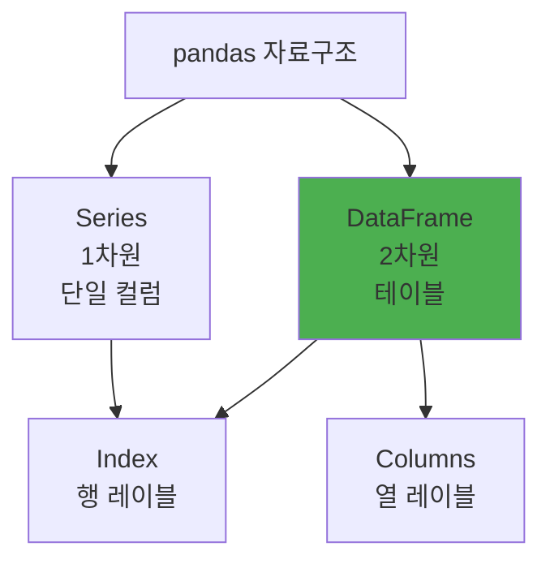

# pandas 완벽 가이드

> **데이터 분석의 표준 라이브러리**

⭐ **2026 추천** | 📊 데이터 분석 | 🐼 사실상 표준 | 🔗 방대한 생태계

---

## 개요

| 항목 | 내용 |
|------|------|
| **공식 사이트** | https://pandas.pydata.org |
| **GitHub** | https://github.com/pandas-dev/pandas |
| **첫 릴리즈** | 2008년 |
| **라이선스** | BSD |

### 한 줄 요약

**데이터 조작 및 분석을 위한 파이썬의 사실상 표준 라이브러리**

---

## 왜 pandas인가

```python
# NumPy만으로는 부족
import numpy as np
data = np.array([[1, 2], [3, 4]])  # 단순 배열, 컬럼명 없음

# pandas는 구조화된 데이터
import pandas as pd
df = pd.DataFrame({
    'name': ['Alice', 'Bob'],
    'age': [25, 30]
})
# 컬럼명, 인덱스, 타입, 메타데이터 모두 포함
```

---

## 핵심 자료구조



---

## 기본 사용법

### DataFrame 생성

```python
import pandas as pd

# Dict에서
df = pd.DataFrame({
    'name': ['Alice', 'Bob', 'Charlie'],
    'age': [25, 30, 35],
    'city': ['NYC', 'LA', 'SF']
})

# CSV에서
df = pd.read_csv('data.csv')

# Excel에서
df = pd.read_excel('data.xlsx', sheet_name='Sheet1')

# SQL에서
import sqlalchemy as sa
engine = sa.create_engine('postgresql://...')
df = pd.read_sql('SELECT * FROM users', engine)

# JSON에서
df = pd.read_json('data.json')
```

### 기본 조작

```python
# 데이터 확인
df.head()          # 처음 5행
df.tail()          # 마지막 5행
df.info()          # 데이터 타입, 메모리 사용량
df.describe()      # 통계 요약

# 선택
df['name']         # 단일 컬럼 (Series)
df[['name', 'age']]  # 여러 컬럼 (DataFrame)
df.loc[0]          # 행 선택 (레이블 기준)
df.iloc[0]         # 행 선택 (위치 기준)

# 필터링
df[df['age'] > 25]
df[(df['age'] > 25) & (df['city'] == 'NYC')]

# 정렬
df.sort_values('age', ascending=False)
df.sort_values(['city', 'age'])
```

---

## 실전 패턴 10가지

### 패턴 1: 결측치 처리

```python
# 결측치 확인
df.isnull().sum()

# 결측치 제거
df.dropna()                    # 결측치 있는 행 제거
df.dropna(subset=['age'])      # 특정 컬럼 기준

# 결측치 채우기
df.fillna(0)                   # 0으로 채우기
df['age'].fillna(df['age'].mean())  # 평균으로
df.fillna(method='ffill')      # 앞 값으로 채우기
```

### 패턴 2: 그룹화 & 집계

```python
# 그룹별 집계
df.groupby('city')['age'].mean()
df.groupby('city').agg({
    'age': ['mean', 'max', 'min'],
    'salary': 'sum'
})

# 여러 컬럼 그룹화
df.groupby(['city', 'department'])['salary'].mean()
```

### 패턴 3: 병합 & 조인

```python
# 두 DataFrame 병합
df1 = pd.DataFrame({'id': [1, 2], 'name': ['Alice', 'Bob']})
df2 = pd.DataFrame({'id': [1, 2], 'age': [25, 30]})

# Inner join
pd.merge(df1, df2, on='id')

# Left join
pd.merge(df1, df2, on='id', how='left')

# 인덱스 기준 조인
df1.join(df2, how='inner')
```

### 패턴 4: Pivot & Melt

```python
# Wide to Long (melt)
df_long = df.melt(
    id_vars=['id', 'name'],
    value_vars=['q1', 'q2', 'q3'],
    var_name='quarter',
    value_name='sales'
)

# Long to Wide (pivot)
df_wide = df_long.pivot(
    index='name',
    columns='quarter',
    values='sales'
)

# Pivot table (with aggregation)
df.pivot_table(
    values='sales',
    index='name',
    columns='quarter',
    aggfunc='sum'
)
```

### 패턴 5: 시계열 데이터

```python
# 날짜 파싱
df['date'] = pd.to_datetime(df['date'])

# 날짜 인덱스
df.set_index('date', inplace=True)

# 리샘플링
df.resample('M').mean()  # 월별 평균
df.resample('W').sum()   # 주별 합계

# 날짜 범위 생성
dates = pd.date_range('2024-01-01', periods=365, freq='D')

# 날짜 컴포넌트 추출
df['year'] = df['date'].dt.year
df['month'] = df['date'].dt.month
df['dayofweek'] = df['date'].dt.dayofweek
```

### 패턴 6: Apply & Lambda

```python
# 단일 컬럼에 함수 적용
df['age_group'] = df['age'].apply(lambda x: 'adult' if x >= 18 else 'minor')

# 행별 적용
df['full_name'] = df.apply(
    lambda row: f"{row['first_name']} {row['last_name']}",
    axis=1
)

# 벡터화 연산 (더 빠름)
df['age_doubled'] = df['age'] * 2  # apply보다 훨씬 빠름
```

### 패턴 7: 문자열 처리

```python
# 대소문자 변환
df['name'] = df['name'].str.lower()

# 패턴 매칭
df[df['email'].str.contains('@gmail.com')]

# 문자열 분할
df[['first_name', 'last_name']] = df['name'].str.split(' ', expand=True)

# 치환
df['text'] = df['text'].str.replace('old', 'new')
```

### 패턴 8: 카테고리 타입

```python
# 메모리 절약
df['city'] = df['city'].astype('category')

# 카테고리 정보
df['city'].cat.categories
df['city'].value_counts()

# 순서 있는 카테고리
df['size'] = pd.Categorical(
    df['size'],
    categories=['S', 'M', 'L', 'XL'],
    ordered=True
)
```

### 패턴 9: Window Functions

```python
# 이동 평균
df['ma_7'] = df['value'].rolling(window=7).mean()

# 누적 합계
df['cumsum'] = df['value'].cumsum()

# 그룹별 윈도우
df['group_rank'] = df.groupby('category')['value'].rank()
```

### 패턴 10: 멀티인덱스

```python
# 멀티인덱스 생성
df.set_index(['city', 'year'], inplace=True)

# 특정 레벨 선택
df.loc[('NYC', 2023)]

# 레벨별 집계
df.groupby(level=0).mean()  # city 레벨

# 인덱스 리셋
df.reset_index()
```

---

## 성능 최적화

### 1. 벡터화 연산 사용

```python
# 나쁨: 느림
for i in range(len(df)):
    df.loc[i, 'new_col'] = df.loc[i, 'col1'] * 2

# 좋음: 빠름
df['new_col'] = df['col1'] * 2
```

### 2. Dtype 최적화

```python
# 메모리 사용량 확인
df.memory_usage(deep=True)

# 타입 최적화
df['age'] = df['age'].astype('int8')  # int64 → int8
df['category'] = df['category'].astype('category')

# 다운캐스트
df = df.apply(pd.to_numeric, downcast='integer')
```

### 3. Chunk 처리

```python
# 대용량 파일
chunks = pd.read_csv('huge.csv', chunksize=10000)

result = []
for chunk in chunks:
    processed = chunk[chunk['value'] > 100]
    result.append(processed)

df = pd.concat(result)
```

---

## pandas vs polars

| 특징 | pandas | polars |
|------|--------|--------|
| 속도 | 기준 | 10배 빠름 |
| 메모리 | 많음 | 효율적 |
| 생태계 | 거대함 | 성장 중 |
| 학습 곡선 | 낮음 | 중간 |

**pandas 선택:**
- 생태계 의존성 (sklearn, scipy)
- 복잡한 데이터 변환
- 작은 데이터 (~1GB)

**polars 선택:**
- 대용량 데이터
- 성능 중요
- 새 프로젝트

---

## 실전 예제

```python
import pandas as pd

# 1. 데이터 로드
df = pd.read_csv('sales.csv', parse_dates=['date'])

# 2. 데이터 정제
df = df.dropna(subset=['amount'])
df = df[df['amount'] > 0]

# 3. 날짜 컬럼 추가
df['year'] = df['date'].dt.year
df['month'] = df['date'].dt.month

# 4. 집계
monthly_sales = df.groupby(['year', 'month']).agg({
    'amount': 'sum',
    'order_id': 'count'
}).rename(columns={'order_id': 'order_count'})

# 5. 피벗
sales_pivot = df.pivot_table(
    values='amount',
    index='product',
    columns='month',
    aggfunc='sum',
    fill_value=0
)

# 6. 저장
monthly_sales.to_csv('monthly_report.csv')
sales_pivot.to_excel('pivot_report.xlsx')
```

---

**[← 데이터 처리](../../04-library-catalog/data-science/README.md)** | **[다음: httpx →](../networking/httpx.md)**
