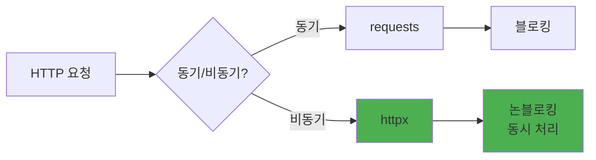

# httpx 완벽 가이드

> **차세대 HTTP 클라이언트**


---

## 개요

| 항목 | 내용 |
|------|------|
| **공식 사이트** | https://www.python-httpx.org |
| **GitHub** | https://github.com/encode/httpx |
| **PyPI** | https://pypi.org/project/httpx/ |
| **첫 릴리즈** | 2019년 |

### 한 줄 요약

**requests 호환 API를 가진 현대적 비동기 HTTP 클라이언트**

---

## 왜 httpx인가

### requests vs httpx



| 특징 | requests | httpx |
|------|----------|-------|
| 비동기 | - 미지원: | - |
| HTTP/2 | - 미지원: | - |
| 동기 모드 | - | - (호환) |
| API | 익숙함 | 동일 |

---

## 설치

```bash
$ uv add httpx

# HTTP/2 지원
$ uv add 'httpx[http2]'
```

---

## 기본 사용법

### 동기 모드 (requests와 동일)

```python
import httpx

# GET
response = httpx.get('https://api.example.com/users')
print(response.status_code)
print(response.json())

# POST
response = httpx.post(
    'https://api.example.com/users',
    json={'name': 'Alice', 'email': 'alice@example.com'}
)

# 헤더
response = httpx.get(
    'https://api.example.com/protected',
    headers={'Authorization': 'Bearer token'}
)

# 파라미터
response = httpx.get(
    'https://api.example.com/search',
    params={'q': 'python', 'page': 1}
)
```

### 비동기 모드 (권장)

```python
import httpx
import asyncio

async def fetch_user(user_id):
    async with httpx.AsyncClient() as client:
        response = await client.get(f'https://api.example.com/users/{user_id}')
        return response.json()

# 실행
user = asyncio.run(fetch_user(1))
```

---

## 실전 패턴

### 패턴 1: 병렬 요청

```python
import httpx
import asyncio

async def fetch_all_users():
    urls = [f'https://api.example.com/users/{i}' for i in range(1, 11)]

    async with httpx.AsyncClient() as client:
        tasks = [client.get(url) for url in urls]
        responses = await asyncio.gather(*tasks)

    return [r.json() for r in responses]

# 10개 요청을 동시에!
users = asyncio.run(fetch_all_users())
```

### 패턴 2: 클라이언트 재사용

```python
class APIClient:
    def __init__(self, base_url, api_key):
        self.client = httpx.AsyncClient(
            base_url=base_url,
            headers={'Authorization': f'Bearer {api_key}'},
            timeout=10.0
        )

    async def get(self, endpoint):
        response = await self.client.get(endpoint)
        response.raise_for_status()
        return response.json()

    async def close(self):
        await self.client.aclose()

# 사용
client = APIClient('https://api.example.com', 'token')
try:
    data = await client.get('/users')
finally:
    await client.close()
```

### 패턴 3: 재시도

```python
from tenacity import retry, stop_after_attempt, wait_exponential

@retry(
    stop=stop_after_attempt(3),
    wait=wait_exponential(multiplier=1, min=2, max=10)
)
async def fetch_with_retry(url):
    async with httpx.AsyncClient() as client:
        response = await client.get(url)
        response.raise_for_status()
        return response.json()
```

### 패턴 4: 스트리밍

```python
async def download_large_file(url, filename):
    async with httpx.AsyncClient() as client:
        async with client.stream('GET', url) as response:
            with open(filename, 'wb') as f:
                async for chunk in response.aiter_bytes(chunk_size=8192):
                    f.write(chunk)
```

### 패턴 5: 타임아웃

```python
# 기본 타임아웃
client = httpx.AsyncClient(timeout=5.0)

# 세밀한 제어
timeout = httpx.Timeout(
    connect=5.0,  # 연결 타임아웃
    read=10.0,    # 읽기 타임아웃
    write=5.0,    # 쓰기 타임아웃
    pool=5.0      # 풀 타임아웃
)
client = httpx.AsyncClient(timeout=timeout)
```

---

## FastAPI 통합

```python
from fastapi import FastAPI
import httpx

app = FastAPI()

# 앱 수명주기에서 클라이언트 관리
@app.on_event("startup")
async def startup():
    app.state.http_client = httpx.AsyncClient()

@app.on_event("shutdown")
async def shutdown():
    await app.state.http_client.aclose()

@app.get("/proxy")
async def proxy_request():
    client = app.state.http_client
    response = await client.get("https://api.external.com/data")
    return response.json()
```

---

## 성능 비교

```python
# requests (동기) - 10개 API 호출
import requests
import time

start = time.time()
for i in range(10):
    response = requests.get(f'https://api.example.com/users/{i}')
print(f"시간: {time.time() - start:.2f}초")  # 약 5초

# httpx (비동기) - 10개 API 호출
import httpx
import asyncio

async def fetch_all():
    async with httpx.AsyncClient() as client:
        tasks = [client.get(f'https://api.example.com/users/{i}') for i in range(10)]
        await asyncio.gather(*tasks)

start = time.time()
asyncio.run(fetch_all())
print(f"시간: {time.time() - start:.2f}초")  # 약 0.5초 (10배 빠름!)
```

---

## 언제 requests, 언제 httpx?

**httpx 선택:**
- - 비동기 I/O 필요
- - 여러 API 동시 호출
- - FastAPI/Starlette 앱
- - HTTP/2 필요

**requests 유지:**
- - 완전 동기 코드
- - 간단한 스크립트
- - 기존 코드베이스

---

**[← 네트워킹](../../04-library-catalog/networking/README.md)** | **[다음: DuckDB →](../data-processing/duckdb.md)**
