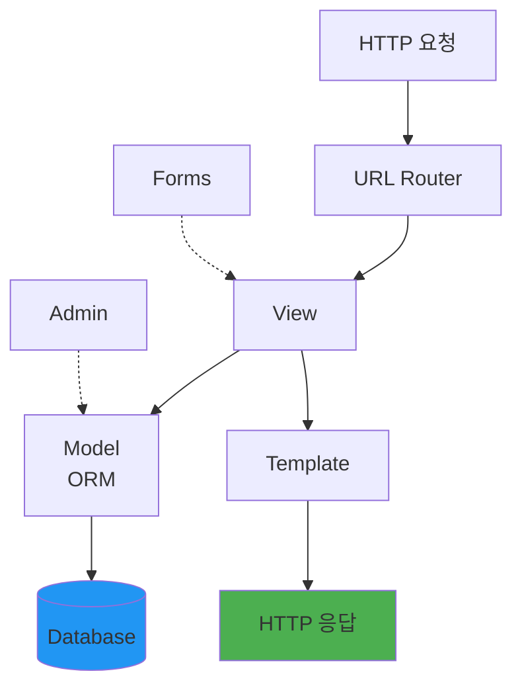

# Django 완벽 가이드

> **전체 솔루션 웹 프레임워크**

⭐ **2026 추천** | 🌐 Full Stack | 🔐 보안 | 📦 Batteries Included

---

## 개요

### 기본 정보

| 항목 | 내용 |
|------|------|
| **공식 사이트** | https://www.djangoproject.com |
| **GitHub** | https://github.com/django/django |
| **첫 릴리즈** | 2005년 |
| **현재 버전** | 5.0+ |
| **라이선스** | BSD |

### 한 줄 요약

**ORM, Admin, Auth를 포함한 완전한 웹 애플리케이션 프레임워크**

---

## 왜 Django인가

### "Batteries Included" 철학

```python
# Django가 기본 제공하는 것들:
✅ ORM (데이터베이스 추상화)
✅ Admin 인터페이스 (자동 생성)
✅ 인증/권한 시스템
✅ 폼 처리 및 검증
✅ 템플릿 엔진
✅ URL 라우팅
✅ 미들웨어 시스템
✅ 보안 기능 (CSRF, XSS, SQL Injection 방어)
✅ 국제화 (i18n)
✅ 캐싱
✅ 세션 관리
```

---

## 핵심 아키텍처



---

## 기본 설치 및 프로젝트 시작

### 설치

```bash
$ uv add django

# 추천 패키지
$ uv add django djangorestframework django-environ
$ uv add --dev django-debug-toolbar
```

### 프로젝트 생성

```bash
# 프로젝트 생성
$ django-admin startproject myproject
$ cd myproject

# 앱 생성
$ python manage.py startapp myapp

# 디렉토리 구조
myproject/
├── myproject/          # 프로젝트 설정
│   ├── __init__.py
│   ├── settings.py     # 설정
│   ├── urls.py         # 루트 URL
│   └── wsgi.py
├── myapp/              # 앱
│   ├── models.py       # 데이터 모델
│   ├── views.py        # 뷰 로직
│   ├── admin.py        # Admin 설정
│   ├── urls.py         # URL 패턴
│   └── templates/      # 템플릿
└── manage.py           # 관리 명령어
```

---

## Model (ORM)

### 기본 모델

```python
# models.py
from django.db import models

class Author(models.Model):
    name = models.CharField(max_length=100)
    email = models.EmailField(unique=True)
    bio = models.TextField(blank=True)
    created_at = models.DateTimeField(auto_now_add=True)

    def __str__(self):
        return self.name

    class Meta:
        ordering = ['name']

class Book(models.Model):
    title = models.CharField(max_length=200)
    author = models.ForeignKey(Author, on_delete=models.CASCADE, related_name='books')
    published_date = models.DateField()
    price = models.DecimalField(max_digits=6, decimal_places=2)
    is_available = models.BooleanField(default=True)

    def __str__(self):
        return self.title
```

### 마이그레이션

```bash
# 마이그레이션 파일 생성
$ python manage.py makemigrations

# 적용
$ python manage.py migrate

# 롤백
$ python manage.py migrate myapp 0001_initial
```

### ORM 쿼리

```python
# 생성
author = Author.objects.create(name="Alice", email="alice@example.com")

# 조회
books = Book.objects.all()
book = Book.objects.get(id=1)
recent_books = Book.objects.filter(published_date__gte='2023-01-01')

# 업데이트
book.price = 19.99
book.save()

# 삭제
book.delete()

# Join (자동으로 최적화됨)
books = Book.objects.select_related('author').all()

# 집계
from django.db.models import Count, Avg
Author.objects.annotate(book_count=Count('books'))

# Raw SQL
Book.objects.raw('SELECT * FROM myapp_book WHERE price > 20')
```

---

## View

### Function-Based View

```python
# views.py
from django.shortcuts import render, get_object_or_404
from django.http import JsonResponse
from .models import Book

def book_list(request):
    books = Book.objects.all()
    return render(request, 'books/list.html', {'books': books})

def book_detail(request, pk):
    book = get_object_or_404(Book, pk=pk)
    return render(request, 'books/detail.html', {'book': book})

def book_api(request):
    books = list(Book.objects.values('title', 'author__name', 'price'))
    return JsonResponse(books, safe=False)
```

### Class-Based View

```python
from django.views.generic import ListView, DetailView, CreateView
from django.urls import reverse_lazy

class BookListView(ListView):
    model = Book
    template_name = 'books/list.html'
    context_object_name = 'books'
    paginate_by = 10

    def get_queryset(self):
        return Book.objects.select_related('author').filter(is_available=True)

class BookDetailView(DetailView):
    model = Book
    template_name = 'books/detail.html'

class BookCreateView(CreateView):
    model = Book
    fields = ['title', 'author', 'published_date', 'price']
    success_url = reverse_lazy('book-list')
```

---

## URL 라우팅

```python
# urls.py
from django.urls import path, include
from . import views

urlpatterns = [
    path('', views.book_list, name='book-list'),
    path('<int:pk>/', views.book_detail, name='book-detail'),

    # Class-based views
    path('books/', views.BookListView.as_view(), name='book-list-cbv'),

    # API
    path('api/books/', views.book_api, name='book-api'),

    # Include
    path('admin/', admin.site.urls),
]
```

---

## Template

```html
<!-- templates/books/list.html -->



<h1>Books</h1>

<ul>

    <li>
        <a href="">
            {{ book.title }}
        </a>
        by {{ book.author.name }}
        - ${{ book.price }}
    </li>

    <li>No books available.</li>

</ul>


    <div class="pagination">
        
            <a href="?page=1">First</a>
            <a href="?page={{ page_obj.previous_page_number }}">Previous</a>
        

        Page {{ page_obj.number }} of {{ page_obj.paginator.num_pages }}

        
            <a href="?page={{ page_obj.next_page_number }}">Next</a>
            <a href="?page={{ page_obj.paginator.num_pages }}">Last</a>
        
    </div>


```

---

## Admin 인터페이스

```python
# admin.py
from django.contrib import admin
from .models import Author, Book

@admin.register(Author)
class AuthorAdmin(admin.ModelAdmin):
    list_display = ['name', 'email', 'created_at']
    search_fields = ['name', 'email']
    list_filter = ['created_at']

@admin.register(Book)
class BookAdmin(admin.ModelAdmin):
    list_display = ['title', 'author', 'price', 'is_available']
    list_filter = ['is_available', 'published_date']
    search_fields = ['title', 'author__name']
    date_hierarchy = 'published_date'
    actions = ['make_available', 'make_unavailable']

    def make_available(self, request, queryset):
        queryset.update(is_available=True)
    make_available.short_description = "Mark as available"
```

---

## Django REST Framework

```python
# serializers.py
from rest_framework import serializers

class BookSerializer(serializers.ModelSerializer):
    author_name = serializers.CharField(source='author.name', read_only=True)

    class Meta:
        model = Book
        fields = ['id', 'title', 'author', 'author_name', 'price', 'published_date']

# views.py
from rest_framework import viewsets

class BookViewSet(viewsets.ModelViewSet):
    queryset = Book.objects.select_related('author')
    serializer_class = BookSerializer
    filterset_fields = ['author', 'is_available']
    search_fields = ['title']
    ordering_fields = ['published_date', 'price']

# urls.py
from rest_framework.routers import DefaultRouter

router = DefaultRouter()
router.register('books', BookViewSet)

urlpatterns = [
    path('api/', include(router.urls)),
]
```

---

## 인증 & 권한

```python
# views.py
from django.contrib.auth.decorators import login_required
from django.contrib.auth.mixins import LoginRequiredMixin, PermissionRequiredMixin

@login_required
def profile(request):
    return render(request, 'profile.html')

class BookCreateView(LoginRequiredMixin, PermissionRequiredMixin, CreateView):
    permission_required = 'myapp.add_book'
    model = Book
    fields = ['title', 'author']

# API 인증
from rest_framework.permissions import IsAuthenticated
from rest_framework.authentication import TokenAuthentication

class BookViewSet(viewsets.ModelViewSet):
    authentication_classes = [TokenAuthentication]
    permission_classes = [IsAuthenticated]
    queryset = Book.objects.all()
```

---

## 설정 관리

```python
# settings.py
import environ

env = environ.Env()
environ.Env.read_env()  # .env 파일 읽기

SECRET_KEY = env('SECRET_KEY')
DEBUG = env.bool('DEBUG', default=False)
DATABASE_URL = env('DATABASE_URL')

DATABASES = {
    'default': env.db()  # DATABASE_URL 파싱
}

# 캐싱
CACHES = {
    'default': {
        'BACKEND': 'django.core.cache.backends.redis.RedisCache',
        'LOCATION': env('REDIS_URL'),
    }
}
```

---

## 실전 팁

### 1. Select_related & Prefetch_related

```python
# N+1 쿼리 방지
books = Book.objects.select_related('author').all()  # JOIN

# Many-to-Many
authors = Author.objects.prefetch_related('books').all()  # 별도 쿼리
```

### 2. 트랜잭션

```python
from django.db import transaction

@transaction.atomic
def create_order(user, items):
    order = Order.objects.create(user=user)
    for item in items:
        OrderItem.objects.create(order=order, item=item)
    # 실패 시 모두 롤백
```

### 3. 캐싱

```python
from django.views.decorators.cache import cache_page
from django.core.cache import cache

# 뷰 캐싱 (60초)
@cache_page(60)
def book_list(request):
    ...

# 수동 캐싱
books = cache.get('all_books')
if not books:
    books = list(Book.objects.all())
    cache.set('all_books', books, 300)  # 5분
```

---

## Django vs FastAPI

| 특징 | Django | FastAPI |
|------|--------|---------|
| 용도 | 전체 웹 앱 | API 전용 |
| Admin | ✅ 내장 | ❌ 없음 |
| ORM | ✅ Django ORM | 선택적 |
| 학습 곡선 | 높음 | 중간 |
| 속도 | 보통 | 빠름 |
| 문서화 | 수동 | 자동 |

**Django 선택 시:**
- Admin 패널 필요
- 전체 웹 애플리케이션
- ORM + 인증 통합 솔루션
- 큰 팀, 표준화된 구조

**FastAPI 선택 시:**
- API만 필요
- 고성능
- 비동기 I/O
- 자동 문서화

---

**[← 웹 프레임워크](../../04-library-catalog/web-development/README.md)** | **[다음: httpx →](../networking/httpx.md)**
