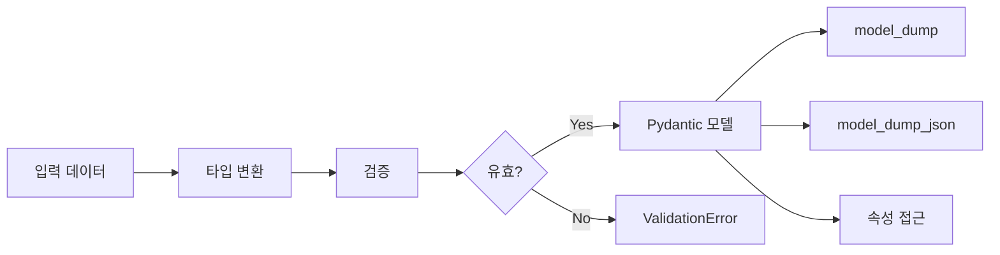
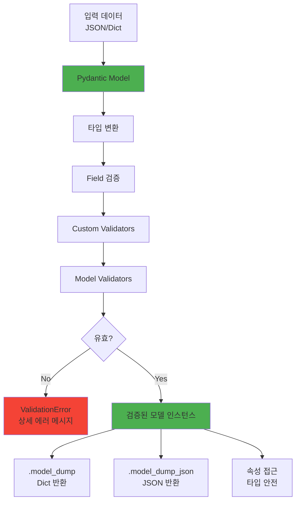

# Pydantic 완벽 가이드

> **타입 안전 데이터 검증의 표준**

⭐ **2026 추천** | ✅ 데이터 검증 | 🔒 타입 안전 | 🚀 FastAPI 핵심

---

## 목차

- [개요](#개요)
- [왜 Pydantic인가](#왜-pydantic인가)
- [핵심 개념](#핵심-개념)
- [설치 및 기본 사용](#설치-및-기본-사용)
- [실전 패턴 12가지](#실전-패턴-12가지)
- [Pydantic v2의 변화](#pydantic-v2의-변화)
- [성능 최적화](#성능-최적화)

---

## 개요

### 기본 정보

| 항목 | 내용 |
|------|------|
| **공식 사이트** | https://docs.pydantic.dev |
| **GitHub** | https://github.com/pydantic/pydantic |
| **PyPI** | https://pypi.org/project/pydantic/ |
| **첫 릴리즈** | 2017년 |
| **현재 버전** | v2 (2023년 대폭 개편) |
| **라이선스** | MIT |

### 한 줄 요약

**Python 타입 힌트를 사용한 데이터 검증 및 설정 관리 라이브러리**

---

## 왜 Pydantic인가

### 기존 방식의 문제

```python
# 수동 검증 (번거롭고 에러 가능성)
def create_user(data: dict):
    if not isinstance(data.get('name'), str):
        raise ValueError("name must be string")
    if not isinstance(data.get('age'), int):
        raise ValueError("age must be int")
    if data['age'] < 0 or data['age'] > 150:
        raise ValueError("age must be 0-150")
    # ... 끝없는 검증 코드
```

### Pydantic 방식

```python
from pydantic import BaseModel, Field

class User(BaseModel):
    name: str
    age: int = Field(..., ge=0, le=150)

# 자동 검증!
user = User(name="Alice", age=30)  # OK
user = User(name="Bob", age=200)   # ValidationError!
```

---

## 핵심 개념

### 1. BaseModel

```python
from pydantic import BaseModel

class User(BaseModel):
    id: int
    name: str
    email: str
    is_active: bool = True  # 기본값

# 사용
user = User(id=1, name="Alice", email="alice@example.com")

# 속성 접근
print(user.name)  # "Alice"

# Dict 변환
user.model_dump()  # {'id': 1, 'name': 'Alice', ...}

# JSON 변환
user.model_dump_json()  # '{"id":1,"name":"Alice",...}'
```

### 2. 데이터 흐름 다이어그램



### 3. 자동 타입 변환

```python
class Item(BaseModel):
    price: float
    quantity: int

# 문자열도 자동 변환
item = Item(price="10.5", quantity="5")
print(item.price)     # 10.5 (float)
print(item.quantity)  # 5 (int)
```

---

## 설치 및 기본 사용

### 설치

```bash
# 기본
$ uv add pydantic

# 이메일 검증 포함
$ uv add 'pydantic[email]'

# 모든 기능
$ uv add 'pydantic[all]'
```

### 기본 모델

```python
from pydantic import BaseModel, EmailStr, HttpUrl
from datetime import datetime

class User(BaseModel):
    id: int
    username: str
    email: EmailStr  # 이메일 형식 검증
    website: HttpUrl | None = None  # URL 형식 검증
    created_at: datetime = Field(default_factory=datetime.now)
    is_active: bool = True

# 생성
user = User(
    id=1,
    username="alice",
    email="alice@example.com",
    website="https://alice.com"
)
```

---

## 실전 패턴 12가지

### 패턴 1: Field를 통한 상세 검증

```python
from pydantic import BaseModel, Field

class Product(BaseModel):
    name: str = Field(..., min_length=1, max_length=100)
    price: float = Field(..., gt=0, description="Price in USD")
    stock: int = Field(default=0, ge=0)
    tags: list[str] = Field(default_factory=list, max_length=10)

# ... = 필수 필드
# gt = greater than (>)
# ge = greater than or equal (>=)
# lt, le = less than (or equal)
```

### 패턴 2: 커스텀 Validator

```python
from pydantic import BaseModel, field_validator

class User(BaseModel):
    username: str
    password: str

    @field_validator('username')
    @classmethod
    def username_alphanumeric(cls, v):
        if not v.isalnum():
            raise ValueError('must be alphanumeric')
        return v

    @field_validator('password')
    @classmethod
    def password_strength(cls, v):
        if len(v) < 8:
            raise ValueError('must be at least 8 characters')
        return v
```

### 패턴 3: Model Validator (여러 필드 검증)

```python
from pydantic import BaseModel, model_validator

class DateRange(BaseModel):
    start_date: datetime
    end_date: datetime

    @model_validator(mode='after')
    def check_dates(self):
        if self.start_date >= self.end_date:
            raise ValueError('start_date must be before end_date')
        return self
```

### 패턴 4: 중첩 모델

```python
class Address(BaseModel):
    street: str
    city: str
    country: str
    zip_code: str

class User(BaseModel):
    name: str
    email: str
    address: Address  # 중첩
    billing_address: Address | None = None

# 사용
user = User(
    name="Alice",
    email="alice@example.com",
    address={
        "street": "123 Main St",
        "city": "NYC",
        "country": "USA",
        "zip_code": "10001"
    }
)
```

### 패턴 5: Config 클래스

```python
class User(BaseModel):
    model_config = {
        "str_strip_whitespace": True,  # 공백 제거
        "str_to_lower": True,          # 소문자 변환
        "frozen": True,                # 불변 객체
        "validate_assignment": True,   # 할당 시에도 검증
    }

    username: str
    email: str

# 사용
user = User(username="  ALICE  ", email="ALICE@EXAMPLE.COM")
print(user.username)  # "alice"
```

### 패턴 6: Computed Fields

```python
from pydantic import BaseModel, computed_field

class Rectangle(BaseModel):
    width: float
    height: float

    @computed_field
    @property
    def area(self) -> float:
        return self.width * self.height

rect = Rectangle(width=10, height=5)
print(rect.area)  # 50.0

# JSON에 포함됨
rect.model_dump()  # {'width': 10, 'height': 5, 'area': 50.0}
```

### 패턴 7: Alias (필드명 변환)

```python
from pydantic import BaseModel, Field

class User(BaseModel):
    user_id: int = Field(alias='userId')  # JSON에서는 userId
    full_name: str = Field(alias='fullName')

# JSON에서 생성
data = {"userId": 1, "fullName": "Alice Smith"}
user = User(**data)

# 다시 JSON으로
user.model_dump(by_alias=True)  # {"userId": 1, "fullName": "Alice Smith"}
```

### 패턴 8: Union Types (여러 타입 허용)

```python
from pydantic import BaseModel

class FlexibleModel(BaseModel):
    value: int | str | float  # 여러 타입 가능
    items: list[int] | dict[str, int]  # 리스트 또는 딕셔너리

# 모두 OK
FlexibleModel(value=10, items=[1, 2, 3])
FlexibleModel(value="hello", items={"a": 1})
FlexibleModel(value=10.5, items=[1, 2])
```

### 패턴 9: Optional과 None

```python
from pydantic import BaseModel

class User(BaseModel):
    name: str
    age: int | None = None  # Optional
    bio: str | None = None

# 모두 OK
User(name="Alice")
User(name="Bob", age=30)
User(name="Charlie", age=None, bio="Developer")
```

### 패턴 10: Generic Models

```python
from pydantic import BaseModel
from typing import Generic, TypeVar

T = TypeVar('T')

class Response(BaseModel, Generic[T]):
    data: T
    status: int
    message: str

class User(BaseModel):
    name: str

# 타입 안전한 응답
response: Response[User] = Response(
    data=User(name="Alice"),
    status=200,
    message="Success"
)
```

### 패턴 11: Settings 관리

```python
from pydantic_settings import BaseSettings

class Settings(BaseSettings):
    app_name: str
    debug: bool = False
    database_url: str
    api_key: str

    model_config = {
        "env_file": ".env",
        "env_file_encoding": "utf-8"
    }

# .env 파일에서 자동 로드
settings = Settings()

# 또는 직접 전달
settings = Settings(
    app_name="MyApp",
    database_url="postgresql://localhost/db",
    api_key="secret"
)
```

### 패턴 12: JSON Schema 생성

```python
from pydantic import BaseModel

class User(BaseModel):
    name: str
    age: int
    email: str

# JSON Schema 생성
schema = User.model_json_schema()

# 출력:
# {
#   "type": "object",
#   "properties": {
#     "name": {"type": "string"},
#     "age": {"type": "integer"},
#     "email": {"type": "string"}
#   },
#   "required": ["name", "age", "email"]
# }
```

---

## Pydantic v2의 변화

### 주요 변경사항

```python
# v1
class User(BaseModel):
    class Config:
        str_strip_whitespace = True

    def dict(self):
        ...

# v2
class User(BaseModel):
    model_config = {
        "str_strip_whitespace": True
    }

    def model_dump(self):  # dict() → model_dump()
        ...
```

### 성능 개선

```
Pydantic v1: 100만 검증/초
Pydantic v2: 500만 검증/초  ← 5배 빠름!
```

---

## 성능 최적화

### 1. TypeAdapter 사용

```python
from pydantic import TypeAdapter

# 단일 타입 검증 (모델 오버헤드 없음)
int_validator = TypeAdapter(int)
int_validator.validate_python("123")  # 123

# 복잡한 타입도 가능
list_validator = TypeAdapter(list[dict[str, int]])
list_validator.validate_python([{"a": 1}, {"b": 2}])
```

### 2. model_construct (검증 스킵)

```python
# 신뢰할 수 있는 데이터 (DB에서 가져온 경우 등)
user = User.model_construct(
    id=1,
    name="Alice",
    email="alice@example.com"
)
# 검증 없이 바로 생성 (빠름)
```

---

## FastAPI와의 통합

```python
from fastapi import FastAPI
from pydantic import BaseModel

app = FastAPI()

class UserCreate(BaseModel):
    username: str
    email: str
    password: str

class UserOut(BaseModel):
    id: int
    username: str
    email: str

@app.post("/users/", response_model=UserOut)
async def create_user(user: UserCreate):
    # user는 이미 검증됨!
    # password는 UserOut에 없어서 응답에서 제외됨
    return UserOut(id=1, username=user.username, email=user.email)
```

---

## 실전 예제: 복잡한 API 모델

```python
from pydantic import BaseModel, Field, field_validator
from datetime import datetime
from enum import Enum

class OrderStatus(str, Enum):
    PENDING = "pending"
    PROCESSING = "processing"
    SHIPPED = "shipped"
    DELIVERED = "delivered"

class OrderItem(BaseModel):
    product_id: int
    quantity: int = Field(..., gt=0)
    price: float = Field(..., gt=0)

    @computed_field
    @property
    def total(self) -> float:
        return self.quantity * self.price

class Order(BaseModel):
    order_id: int
    user_id: int
    items: list[OrderItem] = Field(..., min_length=1)
    status: OrderStatus = OrderStatus.PENDING
    created_at: datetime = Field(default_factory=datetime.now)
    shipping_address: str
    notes: str | None = None

    @computed_field
    @property
    def total_amount(self) -> float:
        return sum(item.total for item in self.items)

    @model_validator(mode='after')
    def check_status_transition(self):
        # 비즈니스 로직 검증
        if self.status == OrderStatus.DELIVERED:
            if not self.shipping_address:
                raise ValueError('shipping_address required for delivered orders')
        return self

# 사용
order = Order(
    order_id=1,
    user_id=100,
    items=[
        {"product_id": 1, "quantity": 2, "price": 10.0},
        {"product_id": 2, "quantity": 1, "price": 25.0},
    ],
    shipping_address="123 Main St"
)

print(order.total_amount)  # 45.0
```

---

## 아키텍처 다이어그램



---

## 베스트 프랙티스

### 1. 입력/출력 모델 분리

```python
# 입력용
class UserCreate(BaseModel):
    username: str
    email: str
    password: str

# 출력용 (password 제외)
class UserOut(BaseModel):
    id: int
    username: str
    email: str

# DB용 (해시된 패스워드 포함)
class UserInDB(UserOut):
    hashed_password: str
```

### 2. 공통 설정 상속

```python
class BaseConfig(BaseModel):
    model_config = {
        "str_strip_whitespace": True,
        "validate_assignment": True,
        "from_attributes": True,  # ORM 모델에서 생성 가능
    }

class User(BaseConfig):
    name: str
    email: str

class Product(BaseConfig):
    title: str
    price: float
```

### 3. 타입 힌트 최대한 활용

```python
from typing import Annotated

# 재사용 가능한 타입
PositiveInt = Annotated[int, Field(gt=0)]
Email = Annotated[str, Field(pattern=r'^[\w\.-]+@[\w\.-]+\.\w+$')]

class User(BaseModel):
    age: PositiveInt
    email: Email
```

---

**[← 데이터 검증](../../04-library-catalog/validation/README.md)** | **[다음: LangChain →](../ai-ml/langchain.md)**
